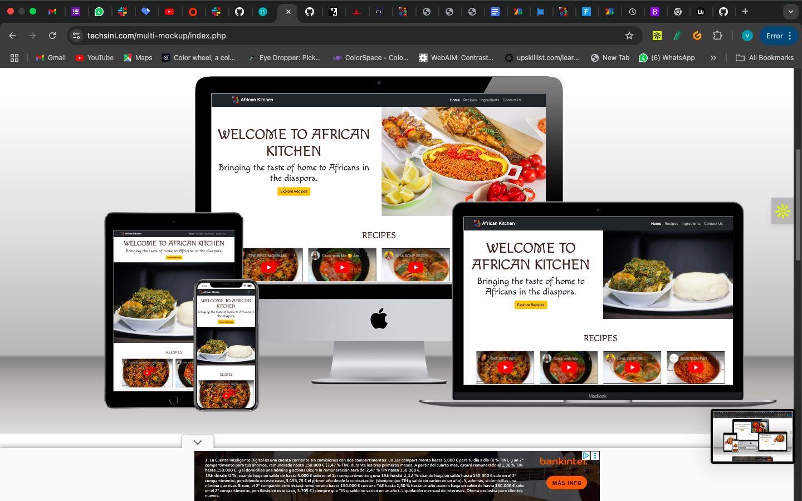
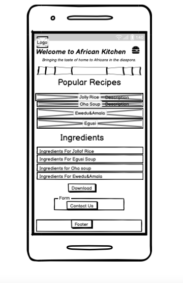
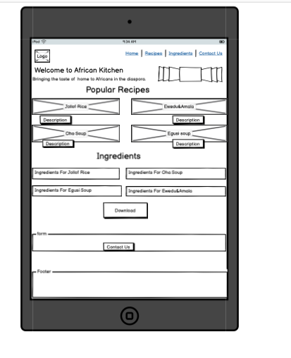
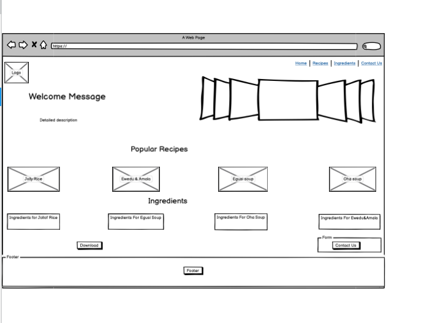
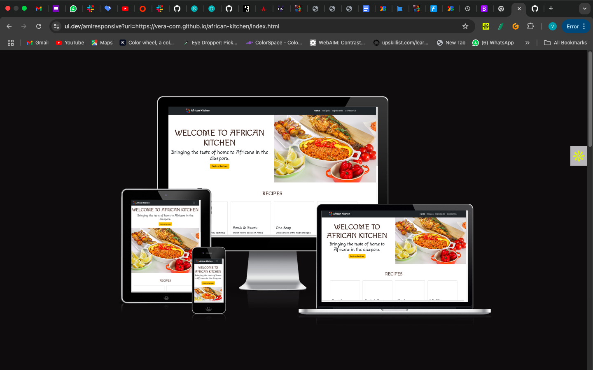
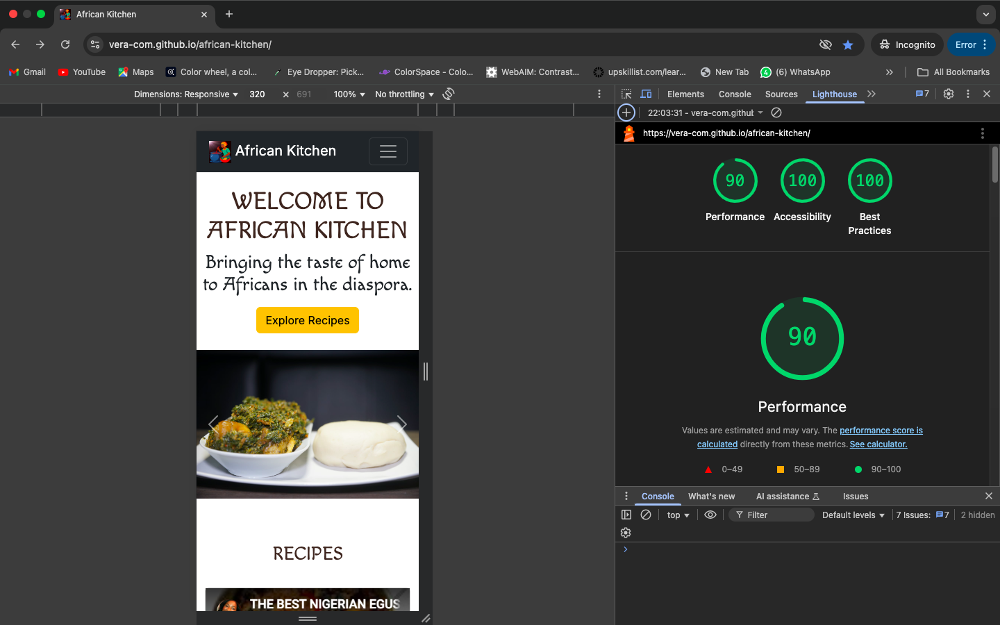
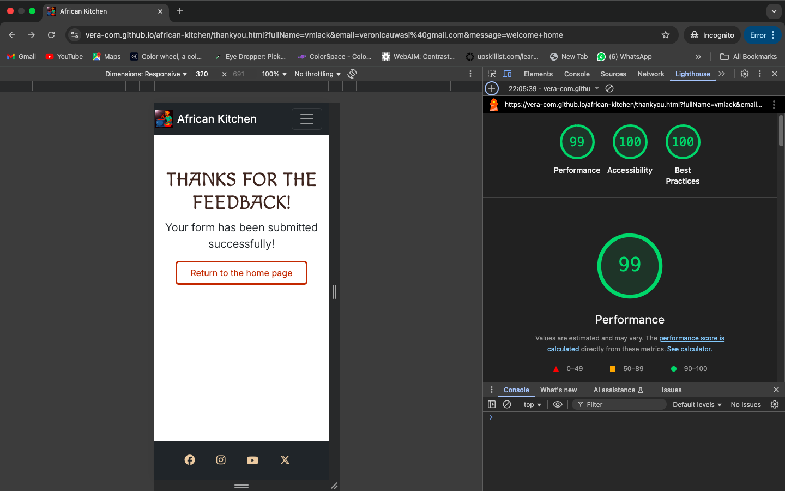
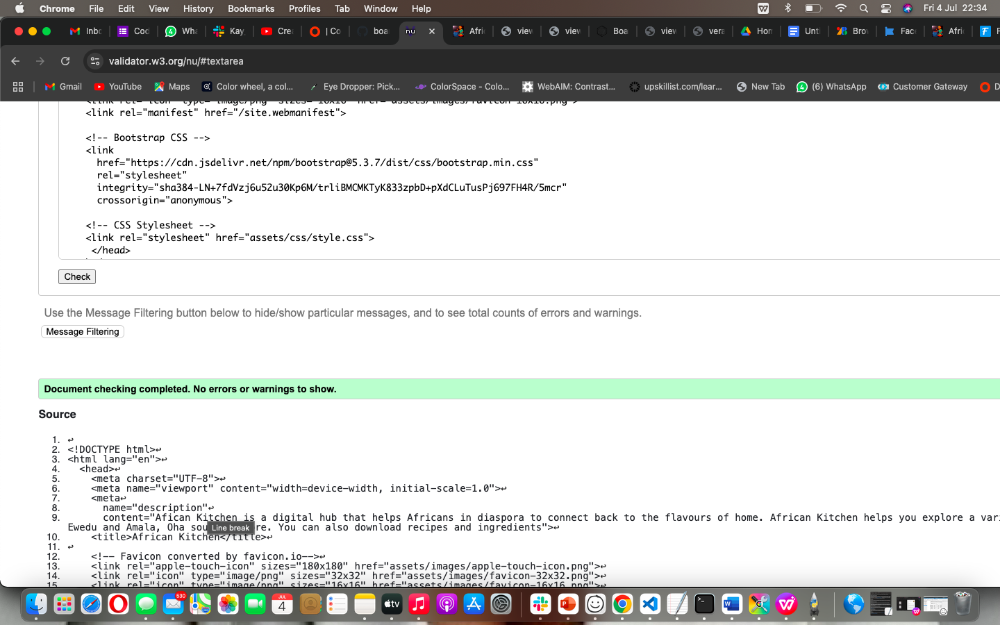
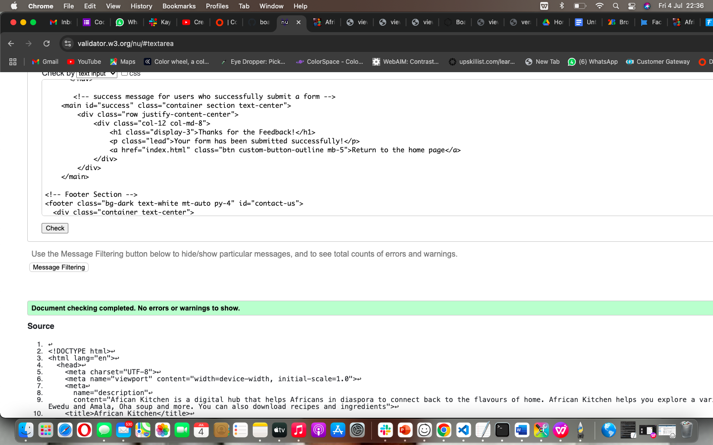
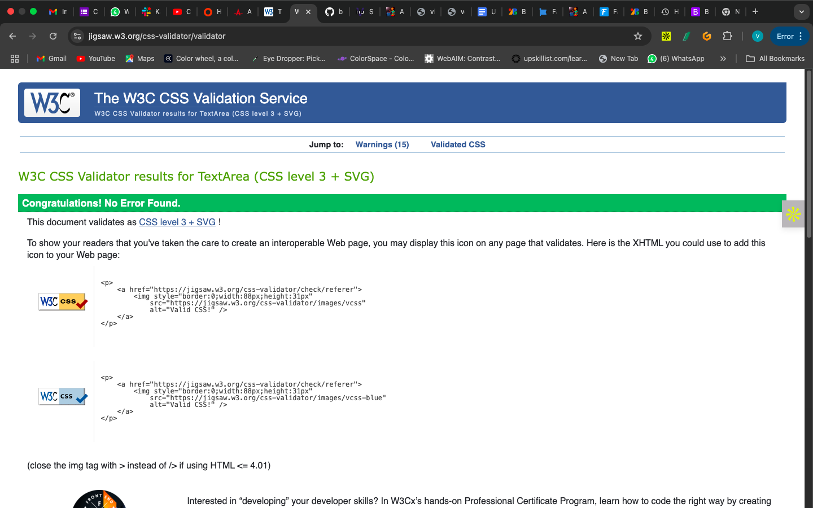

# African Kitchen

This website is focused on sharing African recipes and cooking tips for Africans in the diaspora, students who moved away from home, professional chefs, and food lovers who are willing to learn authentic African cooking. The goal is to preserve traditional African recipes and culture, connect users to culinary roots, and provide easy access to ingredients and instructional videos.

Live Site: [African Kitchen](https://vera-com.github.io/african-kitchen/)

---

## Table of Contents

- [User Experience Section](#user-experience-section)
- [User Stories](#user-stories)
- [Design Section](#design-section)
- [Wireframes](#wireframes)
- [Mockup Preview](#mockup-preview)
- [Features](#features)
- [Future Implementations](#future-implementations)
- [Technologies Used](#technologies-used)
- [Structure](#structure)
- [Challenges Faced](#challenges-i-faced--how-i-solved-them)
- [Deployment & Local Development](#deployment--local-development)
- [Testing](#testing)
- [Credits Section](#credits-section)

---

# User Experience Section

This project is designed with real-life users in mind—Africans abroad, students away from home, and food lovers wishing to reconnect with authentic homemade African meals. It also includes an interactive Jasvascript to enable form validation and improve user navigation.

### UX (The 5 Planes)

- **Strategy**: Build a simple platform to connect users to homemade African food.
- **Scope**: Homepage, food imagery, embedded recipe videos, ingredients list, contact form, footer.
- **Structure**: One-page layout with smooth scroll navigation.
- **Skeleton**: Responsive Bootstrap grid, navbar, sections, containers.
- **Surface**: Warm earthy palette, African-style fonts, inviting visuals.

---

# User Stories

### User Story 1 — MUST-HAVE  
**As a user**, I want to view beautiful African food images to feel welcomed and emotionally connected.

### User Story 2 — MUST-HAVE  
**As a user**, I want to watch recipe videos so I can follow along while cooking.

### User Story 3 — MUST-HAVE  
**As a user**, I want to see a list of ingredients for each dish.

### User Story 4 — MUST-HAVE  
**As a user**, I would like to know if there's a way to contact or follow this site on social media. I also want contact forms that can validate my input with the right information so that i dont submit incorrect information or even a blank form.

### User Story 5 — SHOULD-HAVE  
**As a user**, I want to download recipe files for offline use.

### User Story 6 — SHOULD-HAVE  
**As a user**, I want a form to request information, send feedback, or get private training.

### User Story 7 — SHOULD-HAVE  
**As a user**, I want to share or submit my own recipes.

### User Story 8 — COULD-HAVE  
**As a user**, I’d like a cultural backstory of dishes and testimonials from others.

### User Story 9 — COULD-HAVE  
**As a user**, I want to share a favorite recipe with friends.

---

# Design Section

## Colour Scheme

| Color Name          | HEX Code  |
|---------------------|-----------|
| Golden Brown        | `#996515` | Used for section headings and hovers.
|White                | `#fffaf0` | For clean background section.
|Dark grey            | `#333333` | Text color  
| Black               | `#000`    | Used for paragraph text.
|Burnt orange         | `#cc5500` |
| Border focus        | `#ccc`    | ontact icons (hover)
| Light grey          |#f5f5f5    | Footer background

## Typography

- **Headings**: [Macondo](https://fonts.google.com/specimen/Macondo) (cursive, cultural)
- **Body Text**: [Inter](https://fonts.google.com/specimen/Inter) (clean and modern)

## Imagery

- **Hero Section**: Slideshow featuring dishes like jollof rice, okro soup, moi moi, and more.
- **Recipes Section**: Embedded YouTube videos with guides.
- **Ingredients Section**: Ingredient list with PDF downloads.

---

# Wireframes

Created with **Balsamiq Wireframes**.

### Mobile


### Tablet


### Desktop


---

# Mockup Preview

Generated with [Techsini Multi-Mockup](https://techsini.com/multi-mockup/index.php) and [Am I Responsive](https://ui.dev/amiresponsive).



---

# Features

- Responsive hero section with food slideshow.
- YouTube recipe cards: Egusi, Jollof, Oha, Ewedu & Amala.
- Downloadable PDF ingredient lists.
- Mobile-first responsive design.
- Google Form for contact/feedback.
- Sticky navbar and smooth scrolling.
- Footer with social icons.
- JavaScript form validation to prevent submission of empty or whitespace-only input.
- JavaScript script that removes form data from the URL after submission.
- Clickable logo and brand name in navbar for easy return to homepage.
 

---

## Future Implementations

- Add recipe search bar.
- Newsletter subscription form.
- Ratings & review section.
- Multilingual support.

---

# Technologies Used

- HTML5  
- CSS3 (with custom variables)  
- Bootstrap 5.3.7  
- Google Fonts  
- Font Awesome  
- JavaScript (navbar, scrolling) 
- Custom JavaScript (`script.js`, `minor.js`)
- Balsamiq (wireframe)  
- Lighthouse, W3C Validator

---

# Structure

├── index.html ├── thankyou.html ├── README.md ├── assets/ │ ├── css/ │ │ └── style.css │ ├── images/ │ │ └── [carousel, favicon, logo, meals, wireframes, mockups, tests] │ └── pdfs/ │ └── [Egusi, Jollof, Oha, Ewedu recipes]

├── js/
│   ├── script.js (form validation)
│   └── minor.js (URL cleanup on Thank You page)

---

# Challenges I Faced & How I Solved Them
### 1.
**Issue**:Git command & push issues.
- **Fix**: Used `git pull`, fixed conflicts, then committed again. 

### 2.
- **Issue**:  Sticky navbar + white gap and  Missing logo
- **Fix**: Used `position: fixed`, tweaked `z-index`, and header padding as well as  Fixed favicon path in `<link>`.

### 3
**Issue** Video layout breaking grid and Footer spacing too tight.  
 **Fix**: Used Bootstrap `ratio-16x9` also added padding and margin.

### 4
**Issue** Form not redirecting and Color contrast (Lighthouse)
- **Fix** Fixed with `action="thankyou.html"` and Updated button background/text for better readability 

### 5. Navbar Positioning & Responsiveness
- **Issue**: Navigation links didn’t scroll to correct section positions. Some headings were partially hidden due to tall navbar.
- **Fix**:
  - Adjusted `scroll-margin-top` for all sections (`60px`)
  - Reduced navbar height and ensured logo + brand name are **side by side** using `display: flex`.

### 6. Contact Section Malfunction
- **Issue**: Contact section didn’t respond to hover or tap events; icons were unclickable.
- **Fix**:
  - Cleaned up conflicting styles
  - Ensured correct use of anchor tags and added interaction feedback with hover effects

### 7. Inconsistent Image Display
- **Issue**: Carousel and section images were not displaying due to **case-sensitive filename mismatches**.
- **Fix**:
  - Renamed image files in the `assets/images/` folder to **lowercase**
  - Updated HTML image `src` paths accordingly

### 8. Font Rendering and Block Styling
- **Issue**: Some font styles rendered as block letters unexpectedly.
- **Fix**:
  - Rechecked font imports and `font-family` declarations in CSS
  - Cleaned up inheritance issues from `*` and `body` rules

### 9. Spacing Between Sections
- **Issue**: Sections appeared too tight with no clear padding or spacing.
- **Fix**:
  - Re-applied consistent section `padding: 3rem 1rem`
  - Added `scroll-margin-top` to all anchor-linked sections

### 10. Form Submission with Whitespace or Missing Data
**Issue**: Users could submit the contact form with spaces or incomplete fields.
**Fix**: Added JavaScript validation to trim and check each input.

### 11. URL Parameters Showing on Thank You Page
**Issue**: Form input values were appearing in the thankyou.html page URL.
**Fix**: Added a script to remove query parameters on load (`window.history.replaceState`).


---

# Deployment & Local Development

### Live Deployment

1. Go to your GitHub repo.
2. Click **Settings**.
3. Scroll to **Pages**.
4. Select `main` branch and `/ (root)`.
5. Click **Save** – live at GitHub Pages URL.

###  Local Development

#### Fork the repository
1. Click **Fork** in the upper right of the GitHub repo.
2. You now have your own copy.

#### Clone your fork
```bash
git clone https://vera-com.github.io/african-kitchen/
cd african-kitchen
code .


#Testing
 ## Lighthouse
Scores:
Performance: 90+
Accessibility: 100
Best Practices: 100



 ## HTML Validation
 Validated using W3C HTML Validator



## CSS Validation
 Validated using W3C CSS Validator


## Manual Testing
-Navbar scrolls properly
-All images have alt text
-Responsive across devices
-Contact form submits to thankyou.html page.
- Contact form rejects empty or whitespace-only submissions.
- Thank You page loads without displaying form data in the URL.
- Logo and site name are clickable and return to the home section.


# Credits Section
## Code Pattern
Inspired by Code Institute's Boardwalk Games structure and template.

## Fonts
Google Fonts – Macondo & Inter

## Icons
Font Awesome

## Recipe Videos
Sisi Jemimah – YouTube
Chef Lola’s Kitchen – YouTube
Sisi Yemmie – YouTube

## PDFs & Media
Recipe PDFs from personal documentation and public space like Unsplash /Pexels and a few others (not for commercial use)

Chatgpt assistance with troubleshooting to help improve clarity.

## Acknowledgements
Special thanks to:
Code Institute Slack community
My mentor Jubril for helping me learn to fix problems,the motivation and always being positive.
Family and friends for their continuous love, support and motivation.
---


