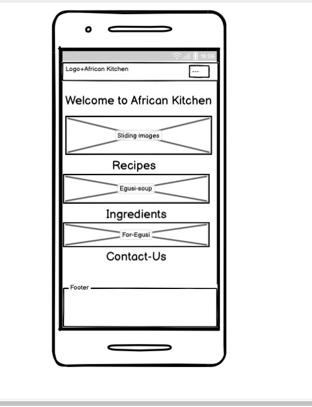
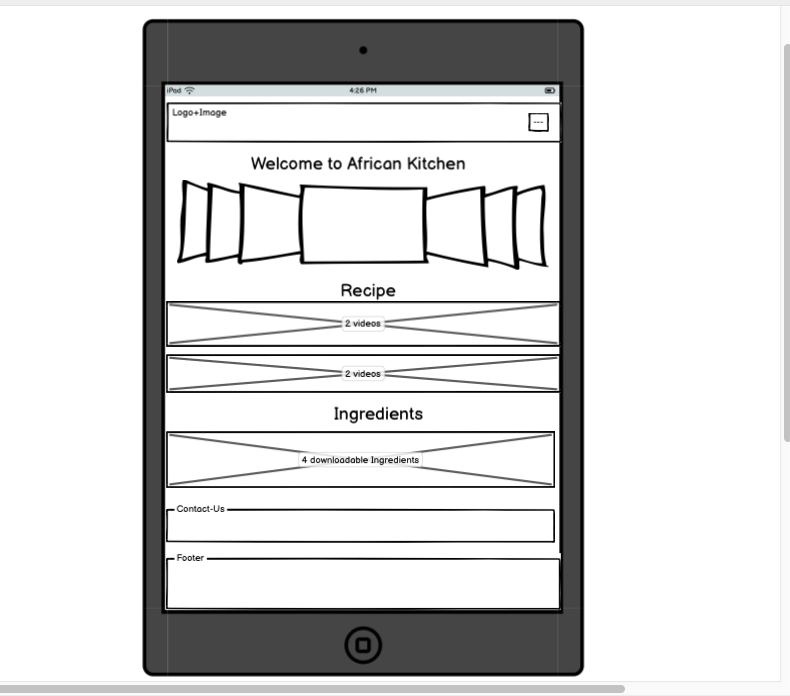
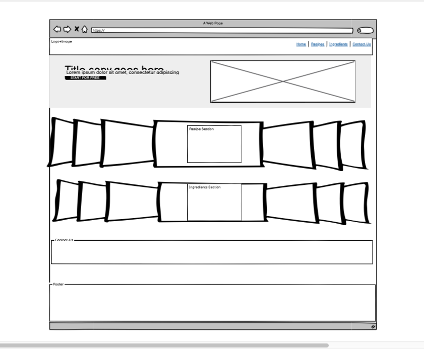

# African Kitchen

This website is focused on sharing African recipes and cooking tips basically for Africans living in diaspora, students who moved away from home, professional chefs even the Gen Z’s that are willing to learn African cooking recipes and food lovers not minding your race. This is to enable us preserve our authentic African recipes and culture at large, it is also aimed at helping users learn how to cook and find the needed ingredients. And for our food lovers, this website will help them connect with African culinary traditions. You’ll all get the opportunity to learn something new and also share your feedback just by clicking on that submit button. It's a single page website with different sections (Home, Recipes, Ingredients and Contact Us).

## Table of Contents

- [User Experience Section](#user-experience-section)
- [User Stories](#user-stories)
- [Design section](#design-section)
- [Wireframes](#wireframes)
- [Technologies Used](#technologies-used)
- [Structure](#structure)
- [Features](#features)
- [Credits Section](#credits-section)
---
# User Experience section

This project is designed in view of real life users. For Africans living in diaspora, students who are away from home, food lovers and many others to reconnect back home through good homemade African food. The following section will describe the user goals, the acceptance criteria and the must complete task to enable the website to be accessible and meet the demands of users.

## UX (The 5 Planes)

- **Strategy**:To build a simple platform for Africans in diaspora to connect back to home through homemade cultural delicacies.
- **Scope**: Homepage, food images, embedded recipe videos, ingredients list, contact-us form and footer with social links.
- **Structure**: One-page layout with smooth scroll navigation.
- **Skeleton**: Responsive Bootstrap grid with navbar, sections, and images/video containers.
- **Surface**: Warm, cultural color palette (earth tones), African-themed fonts, and food visuals.

## User Stories

## This is a summary of the user-centric planning of the website using the must-haves, should-haves and could-haves.

### User Story 1 **MUST-HAVES**

**As a user**,I want to view beautiful African food images that makes me feel welcomed relateable meals and emotionally connect.

**Acceptance Criteria:**

- [] Homepage displays some authentic african dishes
- [] Includes alt text for accessibility
- [] Responsive and look good on all screen sizes

**Task**

- [] Add HTML section for hero section
- [] Hero section with a slideshow of food images with the use of bootstrap carousel
- [] Include quality food images
- [] The layout must adapt on all screen sizes

---

### User Story 2 **MUST-HAVES**

**As a user**,i want to watch recipe videos so I can follow cooking instructions visually while or before cooking.

**Acceptance Criteria:**

- [] Homepage displays list of available recipes
- [] Embedded responsive videos of (Jollof rice, Egusi soup, Oha soup, Ewedu & Amala)
- [] The titles and captions should be visible

**Task**

- [] Add a section on the homepage dedicated for Recipes
- [] Recipes section must have embedded YouTube videos
- [] Collect the YouTube links
- [] Embed inside recipe cards
- [] Use Bootstrap classes for responsiveness

---

### User Story 3 **MUST-HAVES**

**As a user**,I want to see the list of ingredients for each dish to enable me prepare without being confused.
**Acceptance Criteria:**

- [] The homepage displays a section with names "ingredints"
- [] Ingredients match the recipe videos
- [] The ingredients section must be rsponsive on all screen sizes
  **Task**
- [] Include Ingredient list for each recipe
- [] Add asection in the homepage dedicated for ingredients
- [] This section must have a visually appealing layout

---

### User Story 4 **MUST-HAVES**

**As a user**, I would like to know if this site has at least basic contact info or social media to see more information.
**Acceptance Criteria**:

- [] Simple footer with icons
- [] Mobile-friendly

**Task:**

- [] Add footer with social icons using Bootstrap
- [] Style for all screen sizes

---

### User Story 5

**SHOULD-HAVES**
**As a user**, I want to be able to download, screenshot or screenrecord a recipe to enable me use it offline.

**Acceptance Criteria:**  
Download/button works and PDF opens clearly.

**Task**

- [ ] Add preloaded files and link with download attribute
- [ ] Add a download button with file

---

### User Story 6 **SHOULD-HAVES**

**As a user**, I want a form where I can ask questions or suggest a recipe and possibly request for a private training.

**Acceptance Criteria:**  
The form is functional and submission is acknowledged.

**Task**

- [ ]Add Google Form in Contact section
- [ ] Test submission and success message/reponse

---

### Story 7 **SHOULD-HAVES**

**As a user**, I’d love to share my own recipes or submit feedback.
**Acceptance Criteria**:

- [] Submission form or call-to-action
  **Task**
  Add placeholder CTA or section for “Submit Your Recipe”

---

### User Story 8 **COULD-HAVES**

As a user, I want a brief cultural backstory of each dish to enable me connect to my heritage and testimonials from past users of the website.

Acceptance Criteria:

- [] Story is visible, engaging, and culturally relevant.

**Task**

- [] Add short paragraph/story above or below each recipe
- [] Add some testimonials and reviews from the website users

---

### User Story 9 **COULD-HAVES**

**As a user**, I want to save my favorite recipe or share it with friends.

**Acceptance Criteria:**  
Button/link exists and opens and connect share dialogue.

**Task**

- [ ] Add a “Share this” button (optional)
- [ ] Include simple WhatsApp/email share link

---

# Design Section

## Colour scheme

I've chosen these colors especially because it reminds me of traditonal food, spices and warmth that is relatable to Africans and it reminds us of home.

| Color Name     | 
| -------------- | 
| Rich Brown  
  #3a2620' |
| Warm Beige  
  #E8caa4` |
| Highlight Red-orange 
   #b33c12 |
| Light Peach 
 #F3a67f` |
| Deep Blue Accent 
  #416a8e |
 |Light Blue Accent |
 #7a9fc2

---

## Typography

I'll be using **Inter** from Google Fonts for most of the content because of its clean, modern, andits ideal for body text.
- It's **Macondo** for heading and titles because its a cursive google font that adds a bit of cultural and traditional vibe therby matching the African culture and heritage.

## Imagery

#### Hero Image Gallery

The Hero section include a carousel slide show of images.
A rotating slideshow that features vibrant dishes. This concept will immediately engage and reconnect viewers with their cherished home flavors.

**Jollof rice served with grilled fish**
**Mouth watering Okro soup**
**The sumptious Moi Moi**
**The irrsistable Efo riro**
**Nigerian chicken stew**
**Grains and fruit varieties**

#### Popular Recipes section

This section will include YouTube videos with embeded links
Each of the recipe card includes an embedded YouTube video to serve as guide for users visually through cooking steps. This will be of great help to users who want a step by step video tutorial straight to their kitchen.
**Egusi Soup**
**Jollof Rice**
**Oha Soup**
**Ewedu & Amala**

#### Ingredients section

This is an interactive section where users can pick their exact needed ingredient by clicking the "Downlooad" button.

## Wireframes
The wireframes below was created using **Balsamiq Wireframes** to help visualise layout across differnet screen sizes lika the mobile, tablets and desktop.
### Mobile

The Navbar collapses to hamburger and Sections stack vertically.

### Tablet

The layout in the tablet or ipad balances 2-columns and the Images adjust in size.

### Desktop/Laptop

Full navbar, welcome message and hero carousel side by side, recipe grid, ingredients, download and form button and the footer with social links.

---
### Responsive Design
Here i've attached the updated wireframe structure based on current layout across mobile, tablet and desktop.

# Features

- Hero section with sliding food images.
- Embedded YouTube videos for each recipe.
- Clear ingredients with downloadable pdf.
- Responsive design (mobile, tablet, desktop).
- Embedded contact form with a thank-you page.
- Sticky navbar for easy access.
- Social media footer icons.

## Future implementations
- Add a search bar for recipes and ingredients.
- Include a newsletter subscription form.
- Integrate recipe ratings and reviews.
- Add multilingual support for a broader audience.

## TECHNOLOGIES USED
- **HTML5**
- **CSS** (with custom variables and media queries)
- **Bootstrap** 5.3.7
- **Google fonts** (Inter & Macondo)
- **Favicon** (for Logo & header)
- **Font Awesome** (for social links icon)
- **JavaScript** (for scrolling and navbar behavior)

## Structure
├── index.html ├── thankyou.html ├── assets/ │ ├── css/ │ │ └── style.css │ ├── images/ │ │ └── [carousel, favicon, logo, meals, wireframe] │ └── pdfs/ │ └── [Egusi, Jollof, Oha, Ewedu recipes] ├── README.md

## Challenges I Faced & How I Solved Them

| Issue | Solution |
|------|----------|
| **Incomplete git command and git push without the right command** | I had to use git status and git origin pull to find out the issues and then use the editor to fix, afterwards commit right and push.
| **Navbar spacing & sticky behavior** |I Used `position: fixed`, adjusted `padding-top`, applied `z-index` |
| **White gap above navbar** | i had to Reset `padding-top` and margin on body & header |
| **Contact form spacing** | I had to Reduce margin below the form and controlled section padding |
| **Logo not visible** | Corrected favicon path in `<link>` tag |
| **Footer too small** | I had to Increase `padding` and used `mt-5` for spacing |
| **Videos breaking layout** | Used Bootstrap `ratio-16x9` within responsive cards |
| **Form redirect** | Set `action="thankyou.html"` in form and `method="GET"` |

## DEPLOYMENT & LOCAL DEVELOPMENT

### Deployment instructions
This project has deployed using **GitHub Pages**.

1. Navigate to the repository on GitHub.
2. Click on **Settings**.
3. Scroll down to the **Pages** section in the left sidebar.
4. Under **Source**, select the `main` branch and `/root` folder.
5. Click **Save** then the site will be live shortly at the provided GitHub Pages URL.

Local development-how to fork
Local development-how to clone

# TESTING Section

Automated testing:
W3c validator
Lighthouse
Manual testing
Testing user stories
Full testing
Bugs
Known bugs
Solved bugs

---

## CREDITS Section

- **Code Pattern Inspiration:**
  Based on a previous (Boardwalk games) project.
- **Fonts:** [Google Fonts](https://fonts.google.com/)
- **Icons:** [Font Awesome](https://fontawesome.com/)
  **Media**
- **Tutorial Videos by:**
  - Sisi Jemimah – [YouTube](https://www.youtube.com/@SisiJemimah)
  - Chef Lola’s Kitchen – [YouTube](https://www.youtube.com/@ChefLolasKitchen)
  - Sisi Yemmie – [YouTube](https://www.youtube.com/@SisiYemmie)
- **Recipe PDFs:** Sourced from publicly available content like unsplash/Pexels — not for commercial use

**Acknowledgements** Those who have been of help
